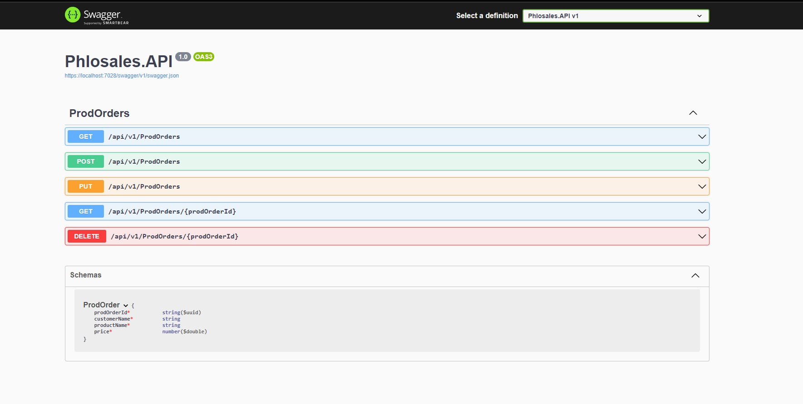
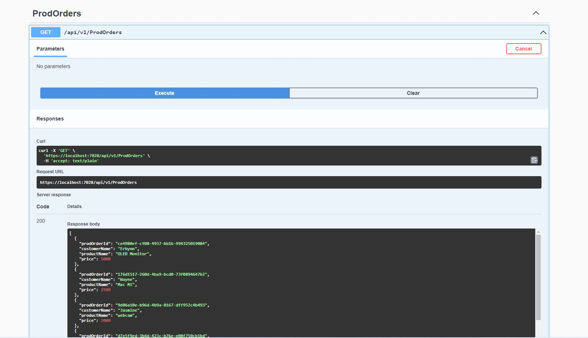
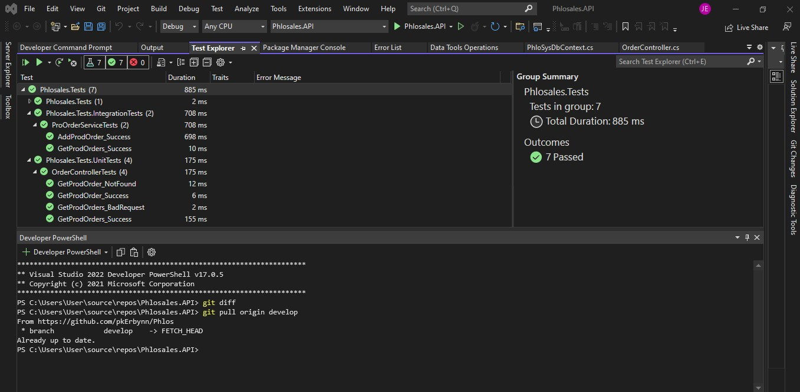
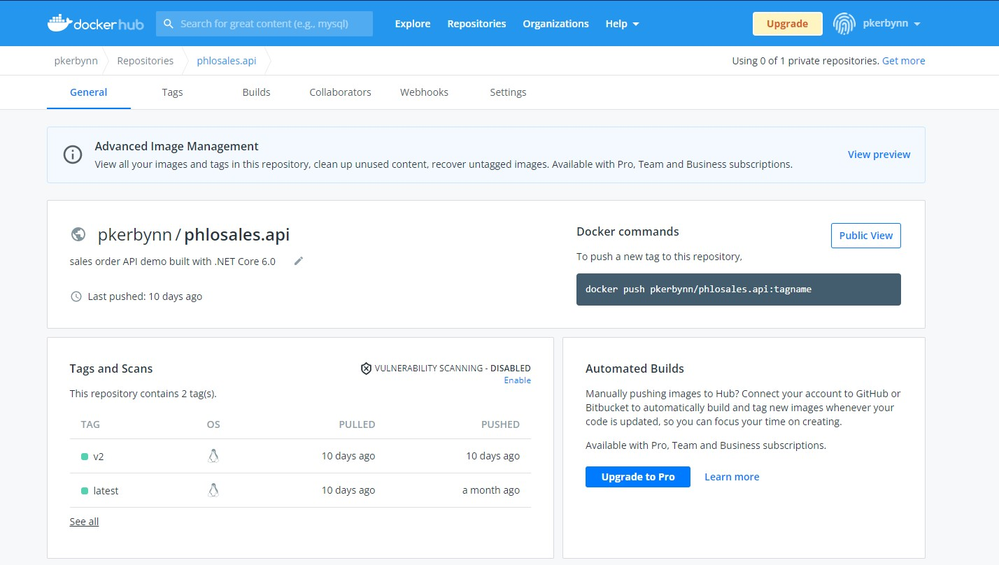

# Phlos 
## Synopsis
Phlos is a RESTful API web application component that allows user to make sale order which is persisted into a data-store.
User can perform these core operations:
- make a sale order
- view all sold products
- other: delete an order (non-core)

## Screenshots





## Technology stack
- PostgreSQL
- Dotnet Core 6.0
- Entity Framework
- XUnit
- GitHub
- GitHub Action
- Docker

## Implementation Best practices
- SOLID principles
- Unit Testing
- Integration Testing
- CI/CD Pipeline
- Automated testing

## Setup
### Requirements
- Visual Studio (Used 2022)

### Usage
1.  Clone this repository
```
$ git clone https://github.com/pkErbynn/Phlos.git
```
2. Open the solution with Visual Studio
3. Start the server

### Docker
1. Pull docker image from registry
```
$ docker pull pkerbynn/phlosales.api
```
2. Check the image 
```
$ docker images
```
3. Run image on port 8080
```
$ docker run -p 8080:80 pkerbynn/phlosales.api
```
4. Go to the API on localhost at `http://localhost:8080/api/v1/prodorders`
5. Now, shutdown the container resource 
```
$ docker ps
$ docker stop <CONTAINER_ID>
```

### Run test
```
dotnet test
```

## Deployment
- Heroku (https://phlosales.herokuapp.com/api/v1/prodorders)
- Docker Hub (https://hub.docker.com/repository/docker/pkerbynn/phlosales.api)
